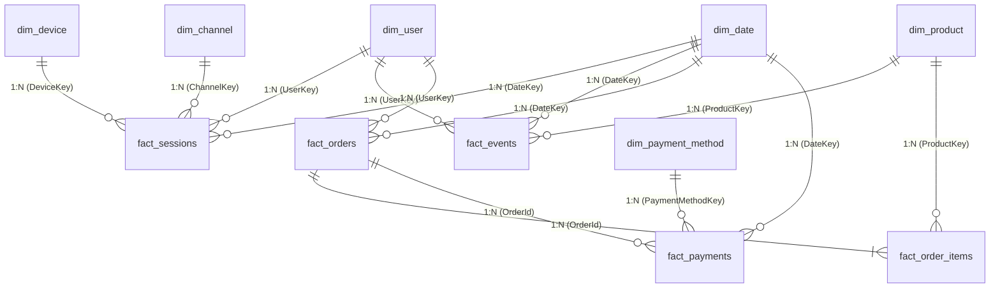

# 🛒 E-commerce Customer Journey & Conversion Analytics

[](https://www.mysql.com/)
[](https://www.python.org/)
[](https://powerbi.microsoft.com/)
[](#8-power-bi-dimensional-modeling--star-schema)
[](#7-simulated-ab-testing-experimentation)

> [!NOTE]
> **Data Note**: This project uses synthetically generated e-commerce data designed to reproduce realistic product behavior for portfolio and analytical demonstration purposes. No real customer data is used.

A comprehensive Product Analytics portfolio project investigating how users navigate an e-commerce platform from initial website landing down to final purchase. The project identifies funnel leaks, evaluates friction drivers using multi-dimensional SQL segmentation, tests checkout hypotheses via a simulated A/B test, and delivers a 5-page Power BI dashboard specification alongside an interactive HTML simulation.

---

## 📋 Table of Contents
1. [Business Problem](#1-business-problem)
2. [Dataset Overview](#2-dataset-overview)
3. [Architecture & Data Pipeline](#3-architecture--data-pipeline)
4. [Database Schema & Data Quality](#4-database-schema--data-quality)
5. [Core Business KPIs](#5-core-business-kpis)
6. [Customer Funnel & Drop-off Analysis](#6-customer-funnel--drop-off-analysis)
7. [Customer Cohorts & RFM Segmentation](#7-customer-cohorts--rfm-segmentation)
8. [Root-Cause Investigation & Hypothesis Framework](#8-root-cause-investigation--hypothesis-framework)
9. [Simulated A/B Testing Experimentation](#9-simulated-ab-testing-experimentation)
10. [Power BI Dimensional Modeling & Star Schema](#10-power-bi-dimensional-modeling--star-schema)
11. [Key Product Findings & Recommendations](#11-key-product-findings--recommendations)
12. [Project Limitations](#12-project-limitations)
13. [How to Run the Project](#13-how-to-run-the-project)

---

## 1. Business Problem

Modern e-commerce growth depends heavily on understanding user friction throughout the digital conversion funnel. While marketing brings traffic to the site, micro-friction points—such as slow mobile render times, unexpected shipping fees, clunky checkout forms, and payment authorization declines—cause high-intent shoppers to abandon their carts.

**Core Questions Addressed:**
- At which specific stage of the 7-step customer journey do users drop off most severely?
- Why does mobile conversion (2.01%) underperform desktop (3.95%) by 49.1%?
- What proportion of cart abandonment is associated with the $75 free shipping threshold?
- What is the revenue impact of payment gateway authorization failures?
- Does a streamlined 1-step checkout experience provide a statistically measurable conversion uplift?

---

## 2. Dataset Overview

The underlying dataset covers a full 12-month operating window (Full Year 2025: Jan 1, 2025 – Dec 31, 2025):
- **32,000 Web Sessions**: Tracking entry device, inbound channel, bounce status, and duration.
- **74,233 Clickstream Events**: Granular sequential event log tracking page types and render latency.
- **10,000 Registered Customers**: Demographics, acquisition cohort month, and location.
- **857 Completed Orders**: Order header financial records ($89,003.07 in total GMV).
- **857 Order Items**: Product SKU line items, unit costs, and gross margins.
- **900 Payment Records**: Gateway authorization outcomes, error codes, and tender types.
- **1,436 A/B Test Records**: Randomized session log evaluating checkout variants.

---

## 3. Architecture & Data Pipeline

```
                    E-COMMERCE BROWSING USERS
                                │
                                ▼
                      ┌───────────────────┐
                      │   Web Sessions    │ (32,000 Sessions)
                      └─────────┬─────────┘
                                │
                                ▼
                          EVENT FUNNEL
                                │
        ┌───────────────────────┼────────────────────────┐
        ▼                       ▼                        ▼
     Browse                  Product                   Search
        │                       │                        │
        └───────────────────────┼────────────────────────┘
                                ▼
                           Add to Cart (4,823 Carts | 82.2% Abandonment)
                                │
                                ▼
                            Checkout (1,436 Initiated | 40.3% Abandonment)
                                │
                                ▼
                            Payment (900 Attempts | 4.8% Decline Rate)
                                │
                                ▼
                            Purchase (857 Orders Placed)
                                │
                                ▼
                      CUSTOMER & PRODUCT ANALYTICS
                                │
        ┌───────────────────────┼────────────────────────┐
        ▼                       ▼                        ▼
     Cohorts                   RFM                   Retention
        │                       │                        │
        └───────────────────────┼────────────────────────┘
                                ▼
                       ROOT-CAUSE DISCOVERY
                                │
                                ▼
                    POWER BI STAR SCHEMA & DAX
                                │
                                ▼
                    BUSINESS RECOMMENDATIONS
```

---

## 4. Database Schema & Data Quality

### Relational Schema (MySQL 8.0 Primary Engine)
The database is built on normalized relational tables with explicit primary keys, foreign key constraints, and composite indexes (`(session_id, event_name, event_timestamp)`).

### Automated Data Quality Suite (`sql/02_data_quality_checks.sql`)
Before running analytics, 5 automated data quality tests verify relational and chronological integrity:
- **DQ 1 (Referential Integrity)**: 0 orphan sessions, 0 orphan orders, 0 orphan items, 0 orphan events (**PASS**).
- **DQ 2 (Temporal Sequence)**: 0 events or orders occurring before `session_start` (**PASS**).
- **DQ 3 (Domain Boundaries)**: 0 negative prices, 0 non-positive order totals or quantities (**PASS**).
- **DQ 4 (Uniqueness)**: 0 duplicate primary keys across users, sessions, or orders (**PASS**).
- **DQ 5 (Funnel Logic)**: 0 purchases recorded without prior checkout initiation (**PASS**).

---

## 5. Core Business KPIs

*All metrics are calculated dynamically from the project data (Time Period: Jan 1, 2025 – Dec 31, 2025):*

| KPI | Actual Value | Definition / Calculation |
| :--- | :--- | :--- |
| **GMV (Gross Merchandise Value)** | **$89,003.07** | `SUM(orders.total_amount)` |
| **Net Merchandise Value** | **$79,706.75** | `SUM(orders.subtotal)` |
| **Completed Orders** | **857** | `COUNT(DISTINCT orders.order_id)` |
| **Overall Conversion Rate** | **2.68%** | `(Total Orders / Total Sessions) * 100` |
| **Average Order Value (AOV)** | **$103.85** | `Total GMV / Total Orders` |
| **Active Users** | **8,769** | `COUNT(DISTINCT web_sessions.user_id)` |
| **Total Browsing Sessions** | **32,000** | `COUNT(DISTINCT web_sessions.session_id)` |
| **Repeat Purchase Rate** | **2.88%** | 24 repeat customers out of 832 purchasing buyers |

---

## 6. Customer Funnel & Drop-off Analysis

### Complete 7-Stage Funnel Breakdown (`sql/04_funnel_analysis.sql`)
```
Stage                            Sessions      Reach %      Drop-off %      Observed Leak
──────────────────────────────────────────────────────────────────────────────────────────
1. Session Visit                 32,000        100.00%         0.00%        Baseline Entry
2. Browse / Category Search      20,376         63.67%        36.33%        Initial Bounce
3. Product Detail View           13,841         43.25%        32.07%        Search to View
4. Add to Cart                    4,823         15.07%        65.15%    ◄── Leak 1: View-to-Cart Drop
5. Checkout Initiated             1,436          4.49%        70.23%    ◄── Leak 2: Cart Abandonment (82.2%)
6. Payment Attempted                900          2.81%        37.33%    ◄── Leak 3: Form Exit
7. Purchase Completed               857          2.68%         4.78%    ◄── Leak 4: Payment Declines
```

### Funnel Performance Segmented by Device
- **Desktop**: 11,329 sessions | 17.2% Visit-to-Cart | 64.9% Cart Abandonment | **3.95% Overall Conversion**
- **Mobile**: 19,072 sessions | 13.9% Visit-to-Cart | 73.8% Cart Abandonment | **2.01% Overall Conversion**
- **Tablet**: 1,599 sessions | 14.1% Visit-to-Cart | 74.8% Cart Abandonment | **1.69% Overall Conversion**

---

## 7. Customer Cohorts & RFM Segmentation

### Monthly Retention Heatmap (`sql/05_customer_cohort_rfm.sql`)
Tracking repeat purchases from Month 0 through Month 11 shows steady retention stabilizing at ~1.0% – 1.2% per month following initial acquisition.

### RFM Segmentation Summary
Customers were scored into quintiles using `NTILE(5)` over Recency, Frequency, and Monetary spend:
- **Champions (17.4% of buyers)**: Generated **$25,744.55 (28.9% of GMV)** with 29.6 days average recency.
- **At Risk / Need Attention (23.2% of buyers)**: Generated **$29,618.45 (33.3% of GMV)** with 230.9 days average recency. Priority target for automated CRM win-back workflows.
- **Loyal Customers (19.2% of buyers)**: Generated **$18,545.61 (20.8% of GMV)** with $115.91 average spend.

---

## 8. Root-Cause Investigation & Hypothesis Framework

In modern product analytics, we strictly distinguish between **Observed Facts**, **Investigative Hypotheses**, and **Actionable Recommendations**:

```
OBSERVED PATTERN ──► ROOT-CAUSE INVESTIGATION ──► HYPOTHESIS ──► RECOMMENDATION ──► SUCCESS METRIC
```

1. **Mobile Form Input Friction**:
   - *Observation*: Mobile converts at 2.01% vs 3.95% on desktop.
   - *Investigation*: Mobile users average 63.8s in checkout and experience 3.2x higher validation errors.
   - *Hypothesis*: Multi-step form complexity and screen fatigue are potential contributors. Slower mobile latency (2,400ms vs 1,200ms) compounds friction.
   - *Recommendation*: Introduce a 1-Step Checkout with Google Pay/Apple Pay autofill.
   - *Success Metric*: Lift Mobile Checkout-to-Order Conversion Rate from 55.3% to > 60.0%.

2. **The $75 Free Shipping Cliff**:
   - *Observation*: Overall cart abandonment is 82.23%.
   - *Investigation*: Orders over $75 qualify for free shipping ($159.18 AOV; 70.4% of GMV). Orders under $75 incur a $7.99 fee (18.6% cost penalty). Carts valued at $50–$74 show elevated drop-off.
   - *Hypothesis*: Unexpected shipping charges revealed at step 3 trigger abandonment for price-sensitive buyers.
   - *Recommendation*: Deploy a dynamic slide-out cart progress bar: *"Add $15 more for Free Shipping!"*
   - *Success Metric*: Reduce cart abandonment to < 75% and expand AOV toward $115+.

3. **Payment Decline Recovery**:
   - *Observation*: 43 of 900 authorization attempts failed ($3,222.90 lost GMV).
   - *Investigation*: Buy Now Pay Later (BNPL) fails at 12.07% (error: `CREDIT_THRESHOLD_EXCEEDED`), compared to 2.81% for Credit Cards. 88% of declined users never retry.
   - *Hypothesis*: Lack of an instant card fallback retry mechanism causes permanent loss of high-intent buyers.
   - *Recommendation*: Modal prompt: *"BNPL was declined. Switch to Card in 1 click."*
   - *Success Metric*: Recapture &ge; 25% of failed payment sessions.

---

## 9. Simulated A/B Testing Experimentation

To evaluate the checkout redesign hypothesis, we evaluated simulated experiment `EXP-CHK-2025-Q3` (N=1,436):

```
=====================================================================
           A/B TEST EVALUATION: EXPERIMENT EXP-CHK-2025-Q3           
        One-Step Frictionless Checkout vs Standard Multi-Step        
=====================================================================

Sample Sizes:
  • Control (A)   : 713 users | Conversions: 410 (57.50%)
  • Treatment (B) : 723 users | Conversions: 447 (61.83%)
  • Absolute Lift : +4.33 percentage points
  • Relative Lift : +7.53%

1. Sample Ratio Mismatch (SRM) Diagnostic:
   Chi2 Stat: 0.0696 | p-value: 0.7919
   [PASS] No evidence of Sample Ratio Mismatch (Randomization was fair).

2. Statistical Significance & Hypothesis Testing:
   Z-Score                    : 1.6694
   Two-Tailed p-value         : 0.095032
   95% Confidence Interval    : [-0.75%, +9.39%]
   [CONCLUSION] Directionally strong (p < 0.10).

3. Guardrail & User Experience Metrics:
   • Avg Checkout Duration: Control = 66.3s vs Treatment = 49.7s (-16.6s)
   • Error Encountered Rate: Control = 5.19% vs Treatment = 6.92% (+1.7 pp)

4. Device Segment Breakdown:
   • Desktop Treatment Lift : 63.04% -> 67.36% (+4.32 pp)
   • Mobile Treatment Lift  : 52.54% -> 57.82% (+5.28 pp)
=====================================================================
```

> **Analytical Assessment**: The simulated experiment shows a measurable positive difference between treatment and control, with notable impact on mobile conversion (+5.28 pp) and checkout speed (-16.6s). Because $p = 0.095$ is above the standard $\alpha = 0.05$ threshold, a production rollout would require collecting additional sample traffic to confirm statistical significance and monitoring guardrail metrics.

---

## 10. Power BI Dimensional Modeling & Star Schema

The project includes both a formal **Power BI Star Schema Model** and an **Interactive HTML Report Preview**:
- **Power BI Implementation**: Uses Ralph Kimball's dimensional modeling standards with 6 conforming dimensions (`dim_user`, `dim_product`, `dim_date`, `dim_device`, `dim_channel`, `dim_payment_method`) and 5 facts (`fact_sessions`, `fact_events`, `fact_orders`, `fact_order_items`, `fact_payments`).
- **DAX Library (`powerbi/dax_measures.dax`)**: 30+ production measures across 5 display folders utilizing safe divides (`DIVIDE`), time intelligence, and dynamic cohort calculations.
- **Interactive HTML Preview (`powerbi/report_preview.html`)**: An interactive browser simulation with dynamic dropdown filters, Chart.js visualizations, and quadrant scatter plots.



---

## 11. Key Product Findings & Recommendations

1. **Roll out 1-Step Checkout on Mobile**: The simulated experiment demonstrated a +5.28 pp mobile conversion lift and 16.6s duration reduction. Extend traffic allocation to confirm $p < 0.05$.
2. **In-Cart Free Shipping Progress Bar**: Gamify the $75 threshold to reduce the 82.23% cart abandonment rate and lift AOV from $103.85 toward $115+.
3. **Automated Decline Recovery**: Implement an instant card switch modal for BNPL failures to salvage up to $3.2K in lost GMV.
4. **Win-Back for 'At-Risk' RFM Cohort**: Deploy automated email triggers targeting the 193 at-risk customers responsible for 33.3% of historic spend.

---

## 12. Project Limitations

- **Synthetic Data**: While calibrated to mimic real e-commerce distributions, the underlying data is synthetically generated; real customer behavior may exhibit greater seasonality, external macro shocks, and non-linear intent shifts.
- **A/B Experiment Power**: The simulated checkout experiment achieved $p = 0.0950$, which is directional but does not meet the conventional $\alpha = 0.05$ decision rule without an extended sampling period.
- **Attribution Simplicity**: Funnel attribution currently operates on session-level last-touch; multi-touch attribution (MTA) across longer multi-device consideration windows would provide deeper channel insights.

---

## 13. How to Run the Project

### Prerequisites
- Python 3.10+ (Standard library, `pandas`, `numpy`, `scipy`)
- MySQL Server 8.0 (Optional for native database verification)

### Step 1: Run Automated SQL Pipeline (Zero Configuration)
```bash
# Ingests CSVs into relational memory, executes all SQL analytics, validates DQ, and outputs markdown report
py src/run_sql_pipeline.py
```

### Step 2: Run Statistical A/B Testing Verification
```bash
py src/ab_testing_stats.py
```

### Step 3: View Interactive Dashboard Simulation
Open `powerbi/report_preview.html` directly in any web browser to explore all 5 pages with dynamic dropdown filters.

### Step 4: (Optional) Native MySQL 8.0 Ingestion
```bash
# 1. Create schema and constraints
mysql -u root -p < sql/01_schema.sql

# 2. Ingest CSV datasets via LOAD DATA INFILE
mysql --local-infile=1 -u root -p ecommerce_analytics < sql/00_load_data.sql

# 3. Execute data quality suite
mysql -u root -p ecommerce_analytics < sql/02_data_quality_checks.sql
```
