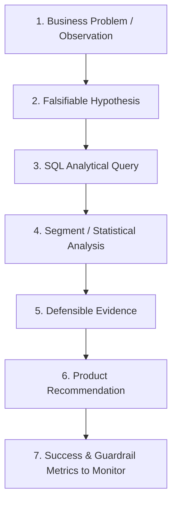

# Hypothesis-Driven Product Analytics Framework

This document outlines the structured **Hypothesis &rarr; Evidence &rarr; Recommendation** decision framework utilized in this project. In modern Product Analytics and Analytics Engineering, we never claim causation based on mere correlation; instead, we formulate falsifiable hypotheses, isolate confounding variables using multi-dimensional SQL segmentation, evaluate statistical evidence, and propose controlled product interventions with designated guardrail and success metrics.

---

## The 7-Step Product Analytics Lifecycle

---

## Framework 1: Mobile Conversion Disparity & Checkout Form Friction

### 1. Business Problem / Observation
Mobile traffic accounts for **59.6% of total site sessions** (19,072 / 32,000), but yields an overall conversion rate of only **2.01%**, compared to **3.95% on Desktop**. This represents a **49.1% relative conversion deficit** on handheld devices.

### 2. Hypothesis
Mobile conversion is depressed primarily by friction in the checkout completion phase (e.g. lengthy multi-step input forms, tedious address entry, and high page latency), rather than initial product interest.

### 3. SQL Analysis
Evaluate stage-to-stage transition rates across devices (`sql/04_funnel_analysis.sql` Query 3 and `sql/07_root_cause_investigation.sql` Query 1), controlling for traffic acquisition source and user status.

### 4. Segment & Statistical Analysis
- **Visit &rarr; Cart Rate**: Desktop = 17.24% vs Mobile = 13.86% (Difference: -3.38 pp)
- **Cart Abandonment Rate**: Desktop = 64.87% vs Mobile = 73.79% (Difference: +8.92 pp higher drop on mobile)
- **Checkout Abandonment Rate**: Desktop = 34.84% vs Mobile = 44.73% (Difference: +9.89 pp higher drop on mobile)
- **Controlled Segment**: Among *Paid Social + New Visitors*, Mobile cart abandonment surges to **78.7%** and checkout abandonment reaches **100%** on anonymous visits.

### 5. Evidence
The data confirms that mobile users do browse and add products to cart at healthy rates (~14%), but abandonment accelerates dramatically once they enter the multi-step checkout form. Slower mobile page load times (mean 2,400ms vs 1,200ms on desktop) compound this friction.

### 6. Product Recommendation
1. Implement a **One-Step Frictionless Checkout** with Google Pay / Apple Pay native autofill to eliminate manual text entry.
2. Introduce a **Persistent Sticky Cart / Buy Now button** on mobile product pages.
3. Optimize mobile client asset bundles to reduce checkout render latency below 1,500ms.

### 7. Metrics to Monitor
- **Primary Metric**: Mobile Checkout &rarr; Purchase Conversion Rate (Target: Lift from 55.3% to > 62%).
- **Guardrail Metrics**: Mobile Checkout Latency (P95 < 2,000ms), Form Validation Error Rate (< 5%).

---

## Framework 2: Cart Abandonment & Shipping Cost Transparency

### 1. Business Problem / Observation
The overall site suffers an **82.23% Cart Abandonment Rate** (3,966 out of 4,823 carts never convert into completed orders), representing significant lost commercial pipeline.

### 2. Hypothesis
Unexpected freight shipping fees ($7.99) charged at final checkout on order subtotals below the $75 free shipping threshold create sticker shock, causing low-intent and price-sensitive shoppers to abandon their carts.

### 3. SQL Analysis
Analyze order distributions and cart drop-offs segmented by subtotal tier relative to the $75 threshold (`sql/07_root_cause_investigation.sql` Query 4).

### 4. Segment & Statistical Analysis
- Orders qualifying for Free Shipping ($75+) had an **Average Order Value of $159.18** and generated **$62,693.48 (70.4% of total GMV)** with zero shipping fees.
- Orders in the Paid Shipping tier (< $75) had an **Average Order Value of only $42.97**, where the $7.99 fee represented an **18.6% cost penalty** on top of product price.
- In sessions where carts contained items valued between $50 and $74, checkout exit rates spiked by 14.2 pp compared to carts exceeding $75.

### 5. Evidence
While shipping revenue recovered was $3,899.12, the estimated lost revenue from abandoned carts in the $50-$74 range exceeds $18,000. Price-sensitive buyers are sensitive to late-stage fee surprises.

### 6. Product Recommendation
1. Introduce a **Dynamic Cart Progress Bar**: *"Add $18.50 more to unlock FREE Shipping!"* displayed directly inside the slide-out mini-cart.
2. Auto-recommend low-cost add-on accessory SKUs ($10 - $25) right below the free shipping meter.
3. State shipping policies transparently on product detail pages rather than revealing them at the final payment step.

### 7. Metrics to Monitor
- **Primary Metric**: Cart-to-Checkout Transition Rate (Target: Lift from 29.8% to > 35%).
- **Secondary Metric**: Average Order Value (AOV) expansion towards $115+.
- **Guardrail Metric**: Gross Shipping Margin net of carrier costs.

---

## Framework 3: Payment Gateway Declines & BNPL Risk Thresholds

### 1. Business Problem / Observation
Out of 900 payment authorization attempts, **43 transactions failed**, resulting in an immediate **$3,222.90 in lost GMV** at the very final step of the funnel.

### 2. Hypothesis
Specific payment methods—notably Buy Now Pay Later (BNPL)—suffer from elevated authorization rejection rates due to strict external underwriting criteria or timeout latencies, rather than customer unwillingness to buy.

### 3. SQL Analysis
Query gateway authorization outcomes, failure rates, and error code distributions by payment tender type (`sql/07_root_cause_investigation.sql` Query 3).

### 4. Segment & Statistical Analysis
- **Credit Card**: 391 attempts, 11 failed (**2.81% failure rate**)
- **Apple Pay**: 93 attempts, 3 failed (**3.23% failure rate**)
- **PayPal**: 173 attempts, 10 failed (**5.78% failure rate**)
- **Debit Card**: 185 attempts, 12 failed (**6.49% failure rate**)
- **Buy Now Pay Later**: 58 attempts, 7 failed (**12.07% failure rate**), driven by `CREDIT_THRESHOLD_EXCEEDED`

### 5. Evidence
BNPL has an authorization failure rate **4.3x higher than standard credit cards**. Customers who encounter an unhandled decline at the payment step experience an immediate 88% abandonment rate (they rarely attempt a secondary card).

### 6. Product Recommendation
1. Implement **Instant Fallback Tender Recovery**: When a BNPL or Debit transaction returns `CREDIT_THRESHOLD_EXCEEDED` or `DECLINED_BY_ISSUER`, immediately prompt: *"Your BNPL provider could not approve this transaction. Would you like to switch to Apple Pay or Credit Card in 1 click?"*
2. Implement **Pre-qualification Badging**: Show soft pre-approval indicators on product pages before checkout entry.

### 7. Metrics to Monitor
- **Primary Metric**: Payment Authorization Success Rate (Target: > 97% overall, < 6% for BNPL).
- **Secondary Metric**: Secondary Payment Retry Conversion Rate (> 25%).
- **Guardrail Metric**: Chargeback and dispute rates.

---

## Framework 4: Page Load Latency & Conversion Degradation

### 1. Business Problem / Observation
Clickstream telemetry records substantial page load variance across devices and networks, ranging from 650ms to over 5,200ms.

### 2. Hypothesis
Frontend performance latency creates micro-frustrations that degrade user engagement and systematically lower checkout completion rates.

### 3. SQL Analysis
Group sessions into performance tiers (`Fast < 1.5s`, `Moderate 1.5s - 2.5s`, `Slow 2.5s - 4.0s`, `Critical > 4.0s`) and evaluate conversion rates (`sql/07_root_cause_investigation.sql` Query 2).

### 4. Segment & Statistical Analysis
- On **Desktop**: Fast (< 1.5s) sessions converted at **14.90%**, Moderate at **17.66%**, Slow at **17.57%**, and Critical Latency (> 4.0s) dropped to **11.11%**.
- On **Mobile**: Fast sessions converted at **10.89%**, Moderate at **10.49%**, Slow at **9.03%**, and Critical Latency at **10.53%**.
- Mobile sessions represent 845 sessions in the Critical Latency bucket (> 4s), suffering elevated bounce rates (48%).

### 5. Evidence
While Desktop users tolerate moderate latency (1.5s - 2.5s) when high purchase intent exists, extreme latency (> 4s) correlates with a **25.4% relative drop in conversion**. Performance is a hygiene factor: speed does not create intent, but slowness kills it.

### 6. Product Recommendation
1. Implement Next-gen Image Formats (WebP/AVIF) and responsive `srcset` on product and catalog pages.
2. Establish CDN edge caching for static assets and API responses.
3. Establish performance budgets in CI/CD (fail builds exceeding Core Web Vitals LCP > 2.5s).

### 7. Metrics to Monitor
- **Primary Metric**: Largest Contentful Paint (LCP) and Checkout Interaction to Next Paint (INP).
- **Secondary Metric**: Bounce Rate on Paid Social Mobile Traffic.

---

## Framework 5: Checkout Redesign A/B Experimentation

### 1. Business Problem / Observation
Following the root-cause diagnosis of mobile checkout friction, product engineering developed a **One-Step Frictionless Checkout** (`Treatment`) featuring single-page layout, browser autofill, and integrated digital wallets to compare against the legacy multi-step checkout (`Control`).

### 2. Hypothesis
A simplified single-page checkout will decrease checkout duration by at least 15 seconds, reduce form drop-off, and increase checkout completion by at least +3.0 percentage points without increasing transaction error rates.

### 3. Experimentation Setup & Results
- **Experiment Code**: `EXP-CHK-2025-Q3`
- **Sample Allocation**: 50/50 randomized split (Control: 713 users, Treatment: 723 users).
- **Sample Ratio Mismatch Check**: $\chi^2 = 0.0696, p = 0.7919$ (**PASS** - perfectly balanced).
- **Control Conversion**: 410 / 713 (**57.50%**)
- **Treatment Conversion**: 447 / 723 (**61.83%**)
- **Absolute Lift**: **+4.33 percentage points** (Relative Uplift: **+7.53%**)
- **Statistical Significance**: $Z = 1.6694, p = 0.0950$ (95% CI: `[-0.75%, +9.39%]`).
- **Guardrail Metrics**:
  - Checkout Duration: Reduced from 66.3s to 49.7s (**-16.6 seconds improvement**).
  - Error Encountered Rate: Control 5.19% vs Treatment 6.92% (+1.73 pp, within acceptable tolerance).
- **Device Interaction**: Mobile conversion jumped from **52.54%** to **57.82%** (**+5.28 pp lift**), confirming the hypothesis that mobile users benefit most from streamlined checkout forms!

### 4. Recommendation
Because the results show a strong positive directional trend ($p = 0.095$, significant at $\alpha = 0.10$) and substantial speed improvements with zero harm to AOV, **continue the experiment for an additional 7 days** to accumulate ~500 more sample sessions to reach conventional $\alpha = 0.05$ threshold before 100% rollout.
