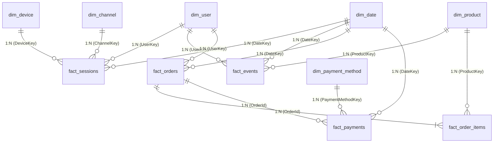

# Power BI Star Schema Architecture & Dimensional Modeling

## 1. Architectural Philosophy
This dimensional model adheres strictly to **Ralph Kimball's dimensional modeling methodology**, structured as a **Constellation Schema (Galaxy Schema)** centered around two key business process fact tables:
1. `fact_sessions` / `fact_events` (Clickstream & Customer Engagement Process)
2. `fact_orders` / `fact_order_items` / `fact_payments` (Transactional & Financial Settlement Process)

Shared conforming dimensions (`dim_user`, `dim_product`, `dim_date`, `dim_device`, `dim_channel`, `dim_payment_method`) unify both processes, enabling seamless drill-across reporting and funnel-to-revenue attribution.

---

## 2. Entity-Relationship & Cardinality Diagram

---

## 3. Dimensional Model Specifications

### Conforming Dimension Tables

#### `dim_date` (Role-Playing Time Dimension)
- **Primary Key**: `date_key` (Format: `YYYYMMDD`, integer, e.g. `20250715`)
- **Attributes**: `full_date`, `year`, `quarter`, `quarter_name`, `month`, `month_name`, `month_year`, `day_of_month`, `day_name`, `is_weekend`, `fiscal_quarter`
- **Granularity**: 1 record per calendar day (365 rows)
- **Power BI Configuration**: Marked as official Date Table.

#### `dim_user` (Customer Dimension - Type 1 SCD)
- **Primary Key**: `user_key` (matches `user_id`)
- **Attributes**: `full_name`, `email`, `gender`, `age_group`, `country`, `state`, `city`, `signup_date`, `cohort_month`
- **Granularity**: 1 record per unique customer (10,000 rows)

#### `dim_product` (Product Catalog Dimension)
- **Primary Key**: `product_key` (matches `product_id`)
- **Attributes**: `product_name`, `category`, `sub_category`, `cost_price`, `retail_price`, `profit_margin_pct`, `price_tier`
- **Granularity**: 1 record per catalog SKU (33 rows)

#### `dim_device` (Hardware Context Dimension)
- **Primary Key**: `device_key`
- **Attributes**: `device_type` (`Desktop`, `Mobile`, `Tablet`), `form_factor`, `touch_enabled`

#### `dim_channel` (Acquisition Channel Dimension)
- **Primary Key**: `channel_key`
- **Attributes**: `traffic_source` (`Organic Search`, `Direct`, `Paid Search`, `Paid Social`, `Email`, `Affiliate`), `channel_group`, `cost_structure`

#### `dim_payment_method` (Tender Type Dimension)
- **Primary Key**: `payment_method_key`
- **Attributes**: `payment_method` (`Credit Card`, `Debit Card`, `PayPal`, `Apple Pay`, `Buy Now Pay Later`), `payment_category`, `processing_fee_pct`

---

### Fact Tables (Business Processes)

#### `fact_sessions` (Session Grain Fact)
- **Granularity**: 1 record per web session (32,000 rows)
- **Keys**: `session_id` (Degenerate Dimension), `user_key`, `date_key`, `device_key`, `channel_key`
- **Measures**: `page_views`, `duration_seconds`, `is_bounced` (0/1), `has_converted` (0/1)

#### `fact_events` (Clickstream Event Grain Fact)
- **Granularity**: 1 record per clickstream interaction (74,233 rows)
- **Keys**: `event_id` (PK), `session_id`, `user_key`, `product_key`, `date_key`
- **Attributes**: `event_name` (`session_visit`, `browse_search`, `product_view`, `add_to_cart`, `checkout_initiated`, `payment_attempted`, `purchase_completed`), `page_type`
- **Measures**: `page_load_ms`

#### `fact_orders` (Order Header Grain Fact)
- **Granularity**: 1 record per completed order (857 rows)
- **Keys**: `order_id` (PK), `user_key`, `session_id`, `date_key`
- **Measures**: `subtotal`, `discount_amount`, `shipping_fee`, `tax_amount`, `total_amount`
- **Attributes**: `order_status`, `shipping_method`

#### `fact_order_items` (Order Line Grain Fact)
- **Granularity**: 1 record per SKU inside an order (857 rows)
- **Keys**: `order_item_id` (PK), `order_id` (FK), `product_key` (FK)
- **Measures**: `quantity`, `unit_price`, `line_total`, `unit_cost`, `line_cost`, `line_profit`

#### `fact_payments` (Settlement Transaction Fact)
- **Granularity**: 1 record per gateway payment authorization attempt (900 rows)
- **Keys**: `payment_id` (PK), `order_id` (Nullable FK), `session_id`, `date_key`, `payment_method_key`
- **Measures**: `amount`
- **Attributes**: `payment_status` (`Successful`, `Failed`), `error_code`

---

## 4. Relationship Table & Filter Direction Rules

| Primary Table (1) | Foreign Key Table (Many) | Primary Key Join | Foreign Key Join | Cardinality | Cross-Filter Direction | Security / Comments |
| :--- | :--- | :--- | :--- | :--- | :--- | :--- |
| `dim_date` | `fact_sessions` | `date_key` | `date_key` | 1:* | Single (1 -> *) | Standard time slice |
| `dim_date` | `fact_orders` | `date_key` | `date_key` | 1:* | Single (1 -> *) | Order date filtering |
| `dim_date` | `fact_events` | `date_key` | `date_key` | 1:* | Single (1 -> *) | Inactive/Secondary if needed |
| `dim_user` | `fact_sessions` | `user_key` | `user_key` | 1:* | Single (1 -> *) | User filtering |
| `dim_user` | `fact_orders` | `user_key` | `user_key` | 1:* | Single (1 -> *) | Cohort & RFM joins |
| `dim_device` | `fact_sessions` | `device_key` | `device_key` | 1:* | Single (1 -> *) | Device drilldowns |
| `dim_channel` | `fact_sessions` | `channel_key` | `channel_key` | 1:* | Single (1 -> *) | Channel drilldowns |
| `dim_product` | `fact_order_items` | `product_key` | `product_key` | 1:* | Single (1 -> *) | Merchandising sales |
| `dim_product` | `fact_events` | `product_key` | `product_key` | 1:* | Single (1 -> *) | Product view analytics |
| `fact_orders` | `fact_order_items` | `order_id` | `order_id` | 1:* | Single (1 -> *) | Header to Line |
| `dim_payment_method`| `fact_payments` | `payment_method_key` | `payment_method_key` | 1:* | Single (1 -> *) | Gateway analytics |

> [!TIP]
> **Bi-directional Filtering Best Practice**: Bi-directional filtering is explicitly **disabled** to avoid ambiguity, circular filter paths, and performance degradation. All cross-filtering across facts is handled via explicit DAX measures using `TREATAS` or `CALCULATE(..., CROSSFILTER(...))`.
